# Android Management API Go 客户端

> 全面、生产就绪的 Google Android Management API Go SDK 与命令行工具

AMAPI 提供一个类型安全的 Go SDK 以及基于 Cobra 的命令行工具，帮助企业快速集成 Android Management API、自动化设备生命周期管理，并构建稳定的运维流程。

## 功能特性

### SDK
- 完整封装 `androidmanagement/v1` 客户端，提供企业、策略、设备、注册令牌、迁移令牌、Web 应用/令牌以及配置信息等服务入口。
- 内置 `context.Context` 支持、统一的 `Close()` 资源回收以及结构化错误类型（位于 `pkgs/amapi/types`）。
- 指数退避自动重试（可选 Redis 协调）、本地与 Redis 双模式速率限制、可配置的超时和日志级别。
- 提供 8 套策略预设、辅助方法（如策略克隆、设备筛选、令牌统计）以及二维码生成等高级能力。
- 丰富的配置管理能力：支持环境变量、YAML/JSON 配置文件、程序化配置与配置克隆。

### CLI
- 11 个命令模块覆盖企业、策略、设备、注册令牌、迁移令牌、Web 应用、Web 令牌、配置信息、配置管理、健康检查与版本信息。
- 所有命令支持 `json`/`yaml`/`table` 输出格式，并提供丰富的交互式提示、确认与表格渲染。
- `health` 命令可执行完整/快速检查，`config` 命令可显示环境变量、验证配置并初始化模板。
- `device` 命令内置常用操作（锁定/重启/恢复出厂/丢失模式/清除应用数据）与预置筛选器。
- `enrollment` 与 `migration` 命令提供批量创建、统计与二维码生成功能。

### 稳定性与可观测性
- 统一的错误包装与重试判定，便于接入重试/熔断策略。
- Redis 分布式速率限制与重试协调（详见 `docs/redis-distributed-limits.md`）。
- 健康检查、配置校验、分页辅助与 CLI 成功/失败高亮输出。
- 通过 `make build/test/lint` 提供标准化构建与质量控制流程。

## 项目组成

- `pkgs/amapi/`：Go SDK（客户端、配置、类型、预设、工具库）。
- `cmd/amapi-cli/`：基于 Cobra 的命令行工具。
- `docs/`：用户指南、快速开始、项目结构、安全说明及报告。
- `terraform/`：Terraform 示例，自动化配置通知通道与权限。
- `scripts/`：辅助脚本（当前包含文档同步脚本）。
- `build/`：`make build` 生成的二进制输出目录。

## 🧩 架构概览

下图展示了 SDK `Client` 与各业务服务之间的关系，以及主要操作入口：



```mermaid
classDiagram
    direction LR

    class Client {
        -ctx context.Context
        -config *config.Config
        -service *androidmanagement.Service
        -httpClient *http.Client
        -retryHandler utils.RetryHandlerInterface
        -rateLimiter utils.RateLimiterInterface
        -redisClient *redis.Client
        -info *types.ClientInfo
        +Enterprises() *EnterpriseService
        +Policies() *PolicyService
        +Devices() *DeviceService
        +EnrollmentTokens() *EnrollmentService
        +MigrationTokens() *MigrationService
        +WebApps() *WebAppService
        +WebTokens() *WebTokenService
        +ProvisioningInfo() *ProvisioningService
        +GetInfo() *types.ClientInfo
        +GetConfig() *config.Config
        +Health() error
        +Close() error
    }

    class EnterpriseService {
        <<Service>>
        +GenerateSignupURL(projectID, callbackURL, adminEmail, displayName, locale)
        +Create(signupToken, projectID, enterpriseToken, contactInfo)
        +Get(name)
        +GetByID(enterpriseID)
        +List(projectID, pageSize, pageToken)
        +Update(name, primaryColor, logo, contactInfo, notifications, autoApprove, terms)
        +Delete(name)
        +EnableNotifications(name, notificationTypes)
        +DisableNotifications(name, notificationTypes)
        +SetPubSubTopic(name, topic)
        +GetApplication(enterpriseName, packageName)
    }

    class PolicyService {
        <<Service>>
        +Create(enterpriseName, policyID, policy)
        +CreateByEnterpriseID(enterpriseID, policyID, policy)
        +Get(name)
        +List(enterpriseName, pageSize, pageToken)
        +Update(name, policy, updateMask)
        +Delete(name)
        +Clone(sourcePolicyName, targetEnterpriseID, targetPolicyID)
        +AddApplication(policyName, app)
        +BlockApplication(policyName, packageName)
        +SetKioskMode(policyName, kioskAppPackage)
        +SetFullyManagedMode(policyName)
        +SetWorkProfileMode(policyName)
    }

    class DeviceService {
        <<Service>>
        +List(enterpriseName, pageSize, pageToken, state, compliant, user)
        +Get(name)
        +IssueCommand(name, command)
        +Lock(name, duration)
        +Reboot(name)
        +Reset(name)
        +RemovePassword(name)
        +StartLostMode(name)
        +StopLostMode(name)
        +Delete(name)
        +GetOperations(name)
        +CancelOperation(operationName)
    }

    class EnrollmentService {
        <<Service>>
        +Create(enterpriseName, policyName, duration, allowPersonalUsage, oneTime, user)
        +CreateQuick(enterpriseID, policyID)
        +List(enterpriseName, pageSize, pageToken, policyName, includeExpired)
        +Get(name)
        +Delete(name)
        +GenerateQRCode(name, options)
        +GetActiveTokens(enterpriseID)
        +CreateBulkTokens(enterpriseID, policyID, count, duration)
        +GetTokenStatistics(enterpriseID)
    }

    class MigrationService {
        <<Service>>
        +Create(enterpriseName, policyName)
        +List(enterpriseName, pageSize, pageToken)
        +Get(name)
        +Delete(name)
        +GetActiveTokens(enterpriseID)
    }

    class WebAppService {
        <<Service>>
        +Create(enterpriseName, startURL, icons, versionCode)
        +List(enterpriseName, pageSize, pageToken)
        +Get(name)
        +Update(name, webApp, updateMask)
        +Delete(name)
    }

    class WebTokenService {
        <<Service>>
        +Create(enterpriseName, webToken)
        +List(enterpriseName, pageSize, pageToken)
        +Get(name)
        +Delete(name)
    }

    class ProvisioningService {
        <<Service>>
        +Get(name)
        +GetByID(provisioningInfoID)
        +GetByDeviceID(deviceID)
        +GetByEnterpriseID(enterpriseID)
    }

    Client --> EnterpriseService : composes
    Client --> PolicyService : composes
    Client --> DeviceService : composes
    Client --> EnrollmentService : composes
    Client --> MigrationService : composes
    Client --> WebAppService : composes
    Client --> WebTokenService : composes
    Client --> ProvisioningService : composes
```

## 快速开始

### 前提条件
- Go 1.24 或更高版本。
- 已启用 Android Management API 的 Google Cloud 项目。
- 具备 `roles/androidmanagement.user` 权限的服务账号及密钥文件。

### 获取代码

```bash
git clone git@github.com:hlxwell/android-amapi-sdk.git
cd android-amapi-sdk/amapi-pkg
go mod tidy
```

### 构建命令行工具

```bash
make build
./build/amapi-cli --help
```

### 首次验证

```bash
./build/amapi-cli health check               # 完整健康检查
./build/amapi-cli enterprise list your-project-id -o table
./build/amapi-cli device list --enterprise LC1234567890 -o table
./build/amapi-cli enrollment create --enterprise LC1234567890 --policy default --duration 24h
./build/amapi-cli provisioning info --device your-device-id -o json
./build/amapi-cli version -o table
```

### 全局选项

- `--config`：指定配置文件路径（默认自动搜索 `config.yaml` / `amapi.yaml` 等）。
- `--debug` / `-d`：启用调试日志并将日志级别提升为 `debug`。
- `--output` / `-o`：大部分命令均支持 `json`、`yaml` 或 `table` 输出格式。

## CLI 命令概览

| 命令 | 用途 | 常用子命令 |
| --- | --- | --- |
| `enterprise` | 企业生命周期管理 | `create`, `list`, `get`, `update`, `delete`, `signup-url`, `notifications enable/disable`, `applications get`, `set-pubsub` |
| `policy` | 策略模板与实例管理 | `create`, `clone`, `list`, `get`, `update`, `delete`, `presets`, `apps add/remove`, `kiosk`, `fully-managed`, `work-profile` |
| `device` | 设备操作与筛选 | `list`, `get`, `lock`, `reboot`, `reset`, `remove-password`, `lost-mode start/stop`, `clear-data`, `filter active/compliant/non-compliant/by-user`, `operations list/get/cancel` |
| `enrollment` | 注册令牌管理 | `create`, `quick`, `list`, `get`, `revoke`, `qrcode`, `bulk-create`, `stats` |
| `migration` | 迁移令牌管理 | `create`, `list`, `get`, `delete`, `stats` |
| `webapp` | 企业 Web 应用 | `create`, `list`, `get`, `update`, `delete` |
| `webtoken` | 企业 Web 令牌 | `create`, `list`, `get`, `delete` |
| `provisioning` | 配置信息查询 | `get`, `info --device/--enterprise/--id` |
| `config` | CLI 配置工具 | `show`, `set`, `validate`, `init`, `environment` |
| `health` | 健康检查 | `check`, `quick`, `connection`, `config` |
| `version` | 构建信息 | 支持 `json`、`yaml`、`table` 输出 |

详细命令说明与示例可参考 `docs/CLI_USAGE.md`。

## SDK 使用

### 模块导入与依赖管理

仓库采用模块名 `amapi-pkg/pkgs/amapi`，顶层 `go.mod` 已通过 `replace` 指向本地 `./pkgs/amapi`。在其他项目中使用时，可将仓库克隆到同一工作区，并在业务项目中添加类似配置：

```go
require amapi-pkg/pkgs/amapi v0.0.0-00010101000000-000000000000

replace amapi-pkg/pkgs/amapi => ../android-amapi-sdk/amapi-pkg/pkgs/amapi
```

或者使用 Go Workspace：

```bash
go work init
go work use ./your-app
go work use ../android-amapi-sdk/amapi-pkg/pkgs/amapi
```

### 示例：加载配置并列出企业

```go
package main

import (
    "context"
    "log"

    "amapi-pkg/pkgs/amapi/client"
    "amapi-pkg/pkgs/amapi/config"
)

func main() {
    cfg, err := config.AutoLoadConfig()
    if err != nil {
        log.Fatalf("加载配置失败: %v", err)
    }

    c, err := client.New(cfg)
    if err != nil {
        log.Fatalf("创建客户端失败: %v", err)
    }
    defer c.Close()

    ctx, cancel := context.WithTimeout(context.Background(), cfg.Timeout)
    defer cancel()

    enterprises, err := c.Enterprises().List(cfg.ProjectID, 0, "")
    if err != nil {
        log.Fatalf("列出企业失败: %v", err)
    }

    log.Printf("项目 %s 下共有 %d 个企业", cfg.ProjectID, len(enterprises.Items))
}
```

### 示例：对设备执行操作

```go
devices, err := c.Devices().GetNonCompliantDevices("LC1234567890")
if err != nil {
    log.Fatalf("获取非合规设备失败: %v", err)
}

for _, device := range devices.Items {
    _, lockErr := c.Devices().Lock(device.Name, "10m")
    if lockErr != nil {
        log.Printf("锁定设备 %s 失败: %v", device.Name, lockErr)
    }
}
```

更多示例请参阅 `docs/USAGE_GUIDE.md` 与 `pkgs/amapi/README.md`。

## 配置参考

### 环境变量

| 变量 | 描述 | 默认值 |
| --- | --- | --- |
| `GOOGLE_CLOUD_PROJECT` | GCP 项目 ID | 必填 |
| `GOOGLE_APPLICATION_CREDENTIALS` | 服务账号密钥文件路径 | 必填 |
| `GOOGLE_APPLICATION_CREDENTIALS_JSON` | 服务账号密钥 JSON 内容 | 空 |
| `AMAPI_SERVICE_ACCOUNT_EMAIL` | 服务账号邮箱（可选） | 空 |
| `AMAPI_SCOPES` | OAuth2 Scopes（逗号分隔） | `https://www.googleapis.com/auth/androidmanagement` |
| `AMAPI_TIMEOUT` | 请求超时时间 | `30s` |
| `AMAPI_RETRY_ATTEMPTS` | 最大重试次数 | `3` |
| `AMAPI_RETRY_DELAY` | 基础重试延迟 | `1s` |
| `AMAPI_ENABLE_RETRY` | 是否启用自动重试 | `true` |
| `AMAPI_CALLBACK_URL` | 企业注册回调地址 | 空 |
| `AMAPI_ENABLE_CACHE` | 是否启用响应缓存（实验） | `false` |
| `AMAPI_CACHE_TTL` | 缓存有效期 | `5m` |
| `AMAPI_LOG_LEVEL` | 日志级别 (`debug` / `info` / `warn` / `error`) | `info` |
| `AMAPI_ENABLE_DEBUG_LOGGING` | 输出调试日志 | `false` |
| `AMAPI_RATE_LIMIT` | 每分钟请求上限 | `100` |
| `AMAPI_RATE_BURST` | 允许的突发数量 | `10` |

> Redis 相关参数（`redis_address`、`redis_password` 等）可通过 YAML/JSON 配置文件设置，详见下方示例与 `docs/redis-distributed-limits.md`。

### YAML 配置示例（`config.yaml`）

```yaml
project_id: "your-project-id"
credentials_file: "./sa-key.json"
callback_url: "https://your-app.example.com/callback"

timeout: "30s"
retry_attempts: 5
retry_delay: "2s"
enable_retry: true

enable_cache: false
cache_ttl: "5m"

log_level: "info"
enable_debug_logging: false

rate_limit: 200
rate_burst: 20

redis_address: "localhost:6379"
redis_password: ""
redis_db: 0
redis_key_prefix: "amapi:dev:"
use_redis_rate_limit: true
use_redis_retry: true
```

## Makefile 与开发脚本

- `make build`：构建当前平台的 `amapi-cli`。
- `make build-all`：生成 Linux/macOS/Windows 多平台二进制。
- `make test` / `make test-coverage`：运行测试与覆盖率统计。
- `make fmt` / `make lint`：格式化与静态检查。
- `make release`：输出跨平台发布包。
- `make clean`：清理构建产物。

## 故障排除

1. **认证失败或权限不足**
   - 确认 `GOOGLE_APPLICATION_CREDENTIALS` 指向有效密钥。
   - 使用 `./build/amapi-cli config validate` 与 `./build/amapi-cli health check --detailed` 检查配置。
2. **构建失败或依赖缺失**
   - 运行 `go clean -modcache && go mod tidy && make build`。
   - 确认使用的 Go 版本 ≥ 1.24。
3. **触发 API 速率限制**
   - 调整配置中的 `rate_limit` / `rate_burst` 或启用 Redis 分布式限流。
4. **资源找不到**
   - 使用资源完整名称（例如 `enterprises/LC1234567890/devices/DEVICE_ID`）。
   - `device filter` 系列命令可快速定位符合条件的设备。
5. **需要更多日志**
   - 通过 `--debug` 或设置 `AMAPI_ENABLE_DEBUG_LOGGING=true` 获取详细输出。

## 安全注意事项

- 切勿将 `sa-key.json` 或其他密钥提交到版本控制。仓库已在 `.gitignore` 中忽略该文件。
- 将敏感配置放置在单独的配置文件或秘密管理服务中。
- 如发现密钥泄露，请立即通过 `gcloud iam service-accounts keys delete` 撤销并重新生成。

## 文档资源

- `docs/QUICKSTART.md`：更详细的 5 分钟上手指南。
- `docs/CLI_USAGE.md`：完整的命令行使用说明与示例。
- `docs/USAGE_GUIDE.md`：SDK API 使用指南。
- `docs/BUILD_GUIDE.md`：构建与发布说明。
- `docs/SECURITY.md`：安全最佳实践。
- `docs/PROJECT_STRUCTURE.md`：目录结构说明。
- `docs/redis-distributed-limits.md`：Redis 分布式限流/重试配置指南。

## 项目结构

```
amapi-pkg/
├── build/                      # 构建输出
├── cmd/
│   └── amapi-cli/
│       ├── cmd/                # Cobra 命令定义
│       ├── internal/           # CLI 公共工具
│       └── main.go
├── docs/                       # 项目文档
│   └── reports/                # 生成的报告
├── pkgs/
│   └── amapi/
│       ├── client/             # SDK 服务实现
│       ├── config/             # 配置加载与验证
│       ├── presets/            # 策略预设
│       ├── types/              # 类型与错误定义
│       └── utils/              # 重试/限流/Redis 工具
├── scripts/
│   └── docs.sh                 # 文档辅助脚本
├── terraform/                  # Terraform 示例
├── config.yaml.example
├── sa-key.json.example
├── go.mod / go.sum
├── Makefile
└── README.md
```

## 贡献指南

1. Fork 仓库并创建特性分支。
2. 在 `pkgs/amapi` 实现 SDK 变更，同时更新 CLI 与文档。
3. 添加或更新测试，确保 `make build`, `make test`, `make lint` 均通过。
4. 提交 Pull Request，并在描述中说明改动与验证步骤。

## 许可证与支持

项目使用 MIT License 发布，详见 `LICENSE` 文件。

- 问题反馈：在 GitHub 上创建 Issue。
- API 参考：<https://developers.google.com/android/management>
- 需要进一步帮助？请查看 `docs/` 目录或联系维护者。

---

Made with ❤️ for Enterprise Android Management
