# AMAPI 包装层分析文档

## 概述

本文档详细分析 `pkgs/amapi` 包装层相对于 Google 原生 Android Management API SDK 的包装实现，以及两者的核心区别。

## 目录

1. [包装层架构](#包装层架构)
2. [核心包装功能](#核心包装功能)
3. [原生 SDK vs 包装层对比](#原生-sdk-vs-包装层对比)
4. [类图](#类图)
5. [详细分析](#详细分析)

---

## 包装层架构

### 整体结构

```
pkgs/amapi/
├── client/          # 服务层：高层次业务抽象
├── types/           # 类型层：自定义类型定义
├── config/          # 配置层：配置管理
├── utils/           # 工具层：重试、限流
├── presets/         # 预设层：策略模板
└── examples/        # 示例代码
```

### 架构分层

```
┌─────────────────────────────────────────────┐
│           用户代码 (User Code)               │
└─────────────────────────────────────────────┘
                      ↓
┌─────────────────────────────────────────────┐
│        高层服务抽象 (Service Layer)          │
│  EnterpriseService | PolicyService | ...     │
└─────────────────────────────────────────────┘
                      ↓
┌─────────────────────────────────────────────┐
│         核心客户端 (Client Core)             │
│  executeAPICall | wrapAPIError | ...         │
└─────────────────────────────────────────────┘
                      ↓
┌──────────────┬──────────────┬───────────────┐
│   重试处理    │   限流控制    │   错误包装     │
│ RetryHandler │ RateLimiter  │  Error Wrap   │
└──────────────┴──────────────┴───────────────┘
                      ↓
┌─────────────────────────────────────────────┐
│      Google AMAPI 原生 SDK                   │
│  google.golang.org/api/androidmanagement/v1 │
└─────────────────────────────────────────────┘
```

---

## 核心包装功能

### 1. 类型包装 (Type Wrapping)

#### 目的
将 Google API 生成的类型转换为更易用、更语义化的自定义类型。

#### 实现方式
```go
// 自定义类型
type Enterprise struct {
    Name         string
    DisplayName  string
    PrimaryColor int64
    // ... 更多字段
    CreatedAt    time.Time  // 新增字段
    UpdatedAt    time.Time  // 新增字段
}

// 转换方法
func FromAMAPIEnterprise(e *androidmanagement.Enterprise) *Enterprise
func (e *Enterprise) ToAMAPIEnterprise() *androidmanagement.Enterprise
```

#### 价值
- 添加业务相关字段（如 CreatedAt, UpdatedAt）
- 提供辅助方法（GetID(), IsValid()）
- 类型更简洁，易于理解和使用

---

### 2. 服务模式包装 (Service Pattern)

#### 目的
将原生 SDK 的 REST 风格 API 包装成面向业务的服务接口。

#### 对比示例

**原生 SDK 调用:**
```go
// 需要手动构建资源名称
enterpriseName := "enterprises/LC00abc123"
enterprise, err := service.Enterprises.Get(enterpriseName).Do()

// 复杂的资源名称管理
deviceName := "enterprises/LC00abc123/devices/ABC123"
device, err := service.Enterprises.Devices.Get(deviceName).Do()

// 需要手动处理参数
call := service.Enterprises.List()
call.ProjectId(projectID)
call.PageSize(100)
result, err := call.Do()
```

**包装层调用:**
```go
// 简洁的 ID 调用
enterprise, err := client.Enterprises().GetByID("LC00abc123")

// 自动处理资源名称
device, err := client.Devices().GetByID("LC00abc123", "ABC123")

// 请求对象模式
result, err := client.Enterprises().List(&types.EnterpriseListRequest{
    ProjectID: projectID,
    PageSize:  100,
})
```

---

### 3. 错误处理包装 (Error Handling)

#### 目的
统一错误类型，提供重试判断和详细错误信息。

#### 自定义错误类型
```go
type Error struct {
    Code      int       // HTTP 状态码或自定义错误码
    Message   string    // 可读错误消息
    Details   string    // 详细信息
    Retryable bool      // 是否可重试
    Timestamp time.Time // 错误时间
    RequestID string    // 请求追踪 ID
    Cause     error     // 原始错误
}
```

#### 智能重试判断
```go
func isRetryableCode(code int) bool {
    switch code {
    case 429,  // Too Many Requests
         500,  // Internal Server Error
         502,  // Bad Gateway
         503,  // Service Unavailable
         504:  // Gateway Timeout
        return true
    default:
        return false
    }
}
```

#### 对比

**原生 SDK:**
```go
result, err := service.Enterprises.Get(name).Do()
if err != nil {
    // 需要手动判断错误类型
    if apiErr, ok := err.(*googleapi.Error); ok {
        if apiErr.Code == 503 {
            // 手动实现重试逻辑
        }
    }
}
```

**包装层:**
```go
result, err := client.Enterprises().Get(name)
if err != nil {
    if apiErr, ok := err.(*types.Error); ok {
        if apiErr.IsRetryable() {
            delay := apiErr.RetryDelay(attempt, baseDelay)
            // 自动重试逻辑已内置
        }
    }
}
```

---

### 4. 弹性能力 (Resilience)

#### 4.1 自动重试机制

**重试处理器实现:**
```go
type RetryHandler struct {
    config RetryConfig
}

func (r *RetryHandler) Execute(operation func() error) error {
    for attempt := 0; attempt < r.config.MaxAttempts; attempt++ {
        err := operation()
        if err == nil {
            return nil
        }

        // 检查是否可重试
        if apiErr, ok := err.(*types.Error); ok {
            if !apiErr.IsRetryable() {
                return err
            }
        }

        // 指数退避 + 抖动
        delay := r.calculateDelay(attempt)
        time.Sleep(delay)
    }
}

// 指数退避算法
func (r *RetryHandler) calculateDelay(attempt int) time.Duration {
    delay := r.config.BaseDelay * (1 << uint(attempt))
    if delay > r.config.MaxDelay {
        delay = r.config.MaxDelay
    }

    // 添加抖动防止惊群效应
    if r.config.Jitter {
        jitter := time.Duration(rand.Float64() * float64(delay) * 0.1)
        delay += jitter
    }
    return delay
}
```

#### 4.2 限流控制

**限流器实现:**
```go
type RateLimiter struct {
    limiter *rate.Limiter
}

func NewRateLimiter(rateLimit, burst int) *RateLimiter {
    // 转换为每秒速率
    r := rate.Limit(float64(rateLimit) / 60.0)
    return &RateLimiter{
        limiter: rate.NewLimiter(r, burst),
    }
}
```

#### 4.3 统一执行流程

```go
func (c *Client) executeAPICall(operation func() error) error {
    // 1. 限流控制
    return c.withRateLimit(func() error {
        // 2. 重试逻辑
        return c.executeWithRetry(operation)
    })
}
```

**对比:**

| 特性 | 原生 SDK | 包装层 |
|------|---------|--------|
| 重试逻辑 | ❌ 需手动实现 | ✅ 自动指数退避 + 抖动 |
| 限流控制 | ❌ 需手动实现 | ✅ Token Bucket 算法 |
| 执行包装 | ❌ 无 | ✅ 统一 executeAPICall |

---

### 5. 资源名称抽象 (Resource Name Abstraction)

#### 目的
简化 AMAPI 的资源命名规范，提供 ID-based 访问。

#### 资源命名规范

AMAPI 使用如下资源命名格式：
- Enterprise: `enterprises/{enterpriseId}`
- Device: `enterprises/{enterpriseId}/devices/{deviceId}`
- Policy: `enterprises/{enterpriseId}/policies/{policyId}`
- Token: `enterprises/{enterpriseId}/enrollmentTokens/{tokenId}`

#### 包装实现

```go
// 构建资源名称
func buildDeviceName(enterpriseID, deviceID string) string {
    return buildResourceName("enterprises", enterpriseID, "devices", deviceID)
}

// 解析资源名称
func parseDeviceName(deviceName string) (string, string, error) {
    components := parseResourceName(deviceName)
    if len(components) != 4 ||
       components[0] != "enterprises" ||
       components[2] != "devices" {
        return "", "", errors.New("invalid device name format")
    }
    return components[1], components[3], nil
}

// 验证 ID
func validateEnterpriseID(enterpriseID string) error {
    if enterpriseID == "" {
        return types.ErrInvalidEnterpriseID
    }
    return nil
}
```

#### 使用对比

**原生 SDK:**
```go
// 需要手动构建和验证资源名称
deviceName := fmt.Sprintf("enterprises/%s/devices/%s", entID, devID)
device, err := service.Enterprises.Devices.Get(deviceName).Do()
```

**包装层:**
```go
// 自动处理资源名称
device, err := client.Devices().GetByID(entID, devID)
```

---

### 6. 配置管理 (Configuration Management)

#### 多源配置加载

```go
// 配置加载优先级
func AutoLoadConfig() (*Config, error) {
    // 1. 环境变量
    if cfg := LoadFromEnv(); cfg != nil {
        return cfg, nil
    }

    // 2. 配置文件（多个路径搜索）
    searchPaths := []string{
        "./config.yaml",
        "~/.config/amapi/config.yaml",
        "/etc/amapi/config.yaml",
    }

    for _, path := range searchPaths {
        if cfg := LoadFromFile(path); cfg != nil {
            return cfg, nil
        }
    }

    // 3. 默认配置
    return DefaultConfig(), nil
}
```

#### 配置结构

```go
type Config struct {
    // 认证配置
    ProjectID         string
    CredentialsJSON   string
    CredentialsFile   string

    // 重试配置
    EnableRetry       bool
    RetryAttempts     int
    RetryDelay        time.Duration

    // 限流配置
    RateLimit         int
    RateBurst         int

    // 其他配置
    Timeout           time.Duration
    CallbackURL       string
    Scopes            []string
}
```

**对比:**

| 特性 | 原生 SDK | 包装层 |
|------|---------|--------|
| 配置来源 | 仅代码 | 环境变量 + 文件 + 代码 |
| 配置验证 | ❌ 无 | ✅ Validate() 方法 |
| 默认值 | ❌ 无 | ✅ 合理默认值 |

---

### 7. 策略预设 (Policy Presets)

#### 目的
提供生产就绪的策略模板，简化常见场景配置。

#### 8 种预设策略

```go
// 1. 完全托管设备
func GetFullyManagedPreset() *PolicyPreset

// 2. 专用设备（Kiosk）
func GetDedicatedDevicePreset() *PolicyPreset

// 3. 工作配置文件
func GetWorkProfilePreset() *PolicyPreset

// 4. Kiosk 模式
func GetKioskModePreset() *PolicyPreset

// 5. COPE（公司拥有，个人启用）
func GetCOPEPreset() *PolicyPreset

// 6. 安全工作站
func GetSecureWorkstationPreset() *PolicyPreset

// 7. 教育平板
func GetEducationTabletPreset() *PolicyPreset

// 8. 零售 Kiosk
func GetRetailKioskPreset() *PolicyPreset
```

#### 使用示例

**原生 SDK:**
```go
// 需要手动配置所有策略细节
policy := &androidmanagement.Policy{
    Name: "enterprises/LC00abc123/policies/kiosk-policy",
    Applications: []*androidmanagement.ApplicationPolicy{
        {
            PackageName: "com.example.app",
            InstallType: "KIOSK",
            DefaultPermissionPolicy: "GRANT",
            // ... 数十个配置项
        },
    },
    KioskCustomization: &androidmanagement.KioskCustomization{
        // ... 更多配置
    },
    // ... 还有更多配置
}
```

**包装层:**
```go
// 使用预设，一行代码
preset := presets.GetKioskModePreset()
policy := preset.Policy

// 或者基于预设进行定制
preset := presets.GetKioskModePreset()
preset.Policy.Applications = append(preset.Policy.Applications, myApp)
```

---

## 原生 SDK vs 包装层对比

### 完整功能对比表

| 功能特性 | 原生 SDK | 包装层 | 说明 |
|---------|---------|--------|------|
| **基础功能** | | | |
| API 调用 | ✅ | ✅ | 完整支持所有 AMAPI 功能 |
| 类型定义 | ✅ 生成类型 | ✅ 自定义类型 | 包装层类型更语义化 |
| 资源命名 | 手动字符串拼接 | 自动处理 | 包装层提供 helper 方法 |
| **错误处理** | | | |
| 错误类型 | `*googleapi.Error` | `*types.Error` | 包装层错误类型更丰富 |
| 错误判断 | 手动类型断言 | 语义化方法 | IsRetryable(), GetErrorType() |
| 重试逻辑 | ❌ 需手动实现 | ✅ 自动重试 | 指数退避 + 抖动 |
| **弹性能力** | | | |
| 自动重试 | ❌ | ✅ | 可配置次数和延迟 |
| 限流控制 | ❌ | ✅ | Token Bucket 算法 |
| 超时控制 | 需手动设置 | 统一配置 | Config.Timeout |
| **配置管理** | | | |
| 配置方式 | 仅代码 | 多源配置 | 环境变量/文件/代码 |
| 配置验证 | ❌ | ✅ | Validate() 方法 |
| 默认值 | ❌ | ✅ | 合理的默认配置 |
| **使用便利性** | | | |
| API 调用风格 | REST 风格 | 服务模式 | client.Enterprises().Get() |
| 参数传递 | 链式调用 | 请求对象 | 类型安全 |
| 策略模板 | ❌ | ✅ | 8 种预设策略 |
| 代码示例 | 基础示例 | 完整示例 | 包含最佳实践 |
| **开发体验** | | | |
| 类型安全 | ✅ | ✅ | 都是强类型 |
| IDE 提示 | 一般 | 良好 | 更清晰的方法命名 |
| 文档质量 | Google Docs | 中文文档 | 详细的中文文档 |
| 学习曲线 | 陡峭 | 平缓 | 更易上手 |

---

### 代码对比示例

#### 示例 1: 创建企业

**原生 SDK (约 30 行):**
```go
import (
    "context"
    "google.golang.org/api/androidmanagement/v1"
    "google.golang.org/api/option"
    "golang.org/x/oauth2/google"
)

func createEnterprise() error {
    ctx := context.Background()

    // 1. 手动加载凭证
    creds, err := google.FindDefaultCredentials(ctx,
        "https://www.googleapis.com/auth/androidmanagement")
    if err != nil {
        return err
    }

    // 2. 创建 HTTP 客户端
    httpClient := oauth2.NewClient(ctx, creds.TokenSource)

    // 3. 创建服务
    service, err := androidmanagement.NewService(ctx,
        option.WithHTTPClient(httpClient))
    if err != nil {
        return err
    }

    // 4. 手动实现重试逻辑
    var result *androidmanagement.Enterprise
    for i := 0; i < 3; i++ {
        result, err = service.Enterprises.Create(&androidmanagement.Enterprise{}).
            ProjectId("my-project").
            SignupUrlName("signup-token").
            Do()
        if err == nil {
            break
        }
        // 手动判断是否可重试
        if apiErr, ok := err.(*googleapi.Error); ok {
            if apiErr.Code == 503 {
                time.Sleep(time.Second * time.Duration(1<<i))
                continue
            }
        }
        return err
    }

    return nil
}
```

**包装层 (约 10 行):**
```go
import (
    "amapi-pkg/pkgs/amapi/client"
    "amapi-pkg/pkgs/amapi/config"
    "amapi-pkg/pkgs/amapi/types"
)

func createEnterprise() error {
    // 1. 自动加载配置（从环境变量或文件）
    cfg, _ := config.AutoLoadConfig()

    // 2. 创建客户端（自动处理认证）
    c, _ := client.New(cfg)
    defer c.Close()

    // 3. 调用 API（自动重试和限流）
    enterprise, err := c.Enterprises().Create(&types.EnterpriseCreateRequest{
        SignupToken: "signup-token",
        ProjectID:   "my-project",
    })

    return err
}
```

**代码行数:** 原生 SDK 30+ 行 vs 包装层 10 行

---

#### 示例 2: 获取设备并处理错误

**原生 SDK:**
```go
func getDevice(enterpriseID, deviceID string) (*androidmanagement.Device, error) {
    // 1. 手动构建资源名称
    deviceName := fmt.Sprintf("enterprises/%s/devices/%s",
        enterpriseID, deviceID)

    // 2. 调用 API
    device, err := service.Enterprises.Devices.Get(deviceName).Do()
    if err != nil {
        // 3. 手动错误处理
        if apiErr, ok := err.(*googleapi.Error); ok {
            switch apiErr.Code {
            case 404:
                return nil, errors.New("device not found")
            case 503:
                // 手动重试逻辑
                time.Sleep(2 * time.Second)
                return service.Enterprises.Devices.Get(deviceName).Do()
            default:
                return nil, fmt.Errorf("API error: %v", apiErr)
            }
        }
        return nil, err
    }

    return device, nil
}
```

**包装层:**
```go
func getDevice(enterpriseID, deviceID string) (*types.Device, error) {
    // 自动处理资源名称、重试、错误包装
    return client.Devices().GetByID(enterpriseID, deviceID)
}
```

---

#### 示例 3: 创建带策略的注册流程

**原生 SDK (约 100+ 行):**
```go
func setupEnrollment() error {
    // 1. 生成注册 URL
    signupURL, err := service.SignupUrls.Create().
        ProjectId(projectID).
        CallbackUrl(callbackURL).
        Do()
    if err != nil {
        return err
    }

    // 2. 创建企业
    enterprise, err := service.Enterprises.Create(&androidmanagement.Enterprise{}).
        ProjectId(projectID).
        SignupUrlName(signupToken).
        Do()
    if err != nil {
        return err
    }

    // 3. 手动配置策略（100+ 行配置）
    policy := &androidmanagement.Policy{
        Applications: []*androidmanagement.ApplicationPolicy{
            {
                PackageName: "com.example.app",
                InstallType: "FORCE_INSTALLED",
                DefaultPermissionPolicy: "GRANT",
                // ... 数十个配置项
            },
        },
        PasswordPolicies: []*androidmanagement.PasswordRequirements{
            {
                PasswordMinimumLength: 8,
                // ... 更多配置
            },
        },
        // ... 还有大量配置
    }

    // 4. 创建策略
    _, err = service.Enterprises.Policies.Patch(policyName, policy).Do()
    if err != nil {
        return err
    }

    // 5. 创建注册令牌
    token, err := service.Enterprises.EnrollmentTokens.Create(
        enterpriseName,
        &androidmanagement.EnrollmentToken{
            PolicyName: policyName,
        },
    ).Do()
    if err != nil {
        return err
    }

    // 6. 手动生成 QR 码数据
    qrData := fmt.Sprintf(`{
        "android.app.extra.PROVISIONING_DEVICE_ADMIN_COMPONENT_NAME": "...",
        "android.app.extra.PROVISIONING_DEVICE_ADMIN_SIGNATURE_CHECKSUM": "...",
        "android.app.extra.PROVISIONING_DEVICE_ADMIN_PACKAGE_DOWNLOAD_LOCATION": "...",
        "android.app.extra.PROVISIONING_ADMIN_EXTRAS_BUNDLE": {
            "token": "%s"
        }
    }`, token.Value)

    return nil
}
```

**包装层 (约 20 行):**
```go
func setupEnrollment() error {
    // 1. 生成注册 URL
    signupURL, _ := client.Enterprises().GenerateSignupURL(&types.SignupURLRequest{
        ProjectID:   projectID,
        CallbackURL: callbackURL,
    })

    // 2. 创建企业
    enterprise, _ := client.Enterprises().Create(&types.EnterpriseCreateRequest{
        SignupToken: signupToken,
    })

    // 3. 使用预设策略
    preset := presets.GetFullyManagedPreset()
    policy, _ := client.Policies().Create(enterprise.Name, &types.PolicyCreateRequest{
        Policy: preset.Policy,
    })

    // 4. 创建注册令牌（自动生成 QR 码）
    token, _ := client.EnrollmentTokens().Create(&types.EnrollmentTokenCreateRequest{
        EnterpriseName: enterprise.Name,
        PolicyName:     policy.Name,
        AllowPersonalUsage: types.AllowPersonalUsageNotAllowed,
    })

    // 5. QR 码数据已自动生成在 token.QRCodeData 中
    qrCode := token.GenerateQRCode(&types.QRCodeOptions{Size: 512})

    return nil
}
```

---

## 类图

### 核心类图


### 调用流程图

```mermaid
sequenceDiagram
    participant User as 用户代码
    participant Client as Client
    participant Service as EnterpriseService
    participant Limiter as RateLimiter
    participant Retry as RetryHandler
    participant SDK as Google AMAPI SDK

    User->>Client: Enterprises().GetByID(id)
    Client->>Service: GetByID(id)
    Service->>Service: validateEnterpriseID(id)
    Service->>Service: buildEnterpriseName(id)
    Service->>Client: executeAPICall(operation)

    Client->>Limiter: Wait(ctx)
    Limiter-->>Client: OK

    Client->>Retry: Execute(operation)

    loop 最多 3 次重试
        Retry->>SDK: service.Enterprises.Get(name).Do()

        alt 成功
            SDK-->>Retry: enterprise, nil
            Retry-->>Client: nil
        else 可重试错误 (503, 429)
            SDK-->>Retry: nil, error
            Retry->>Retry: calculateDelay(attempt)
            Note over Retry: 指数退避 + 抖动
            Retry->>Retry: time.Sleep(delay)
        else 不可重试错误 (404, 403)
            SDK-->>Retry: nil, error
            Retry-->>Client: error
        end
    end

    Client->>Client: wrapAPIError(err)
    Client->>Service: error or result
    Service->>Service: FromAMAPIEnterprise(result)
    Service-->>User: *Enterprise or *Error
```



---

## 详细分析

### 1. 设计模式应用

#### 1.1 适配器模式 (Adapter Pattern)

**目的:** 将 Google AMAPI SDK 的接口适配为更符合业务需求的接口。

```go
// 适配器：类型转换层
func FromAMAPIEnterprise(e *androidmanagement.Enterprise) *Enterprise {
    return &Enterprise{
        Name:         e.Name,
        DisplayName:  extractDisplayName(e),
        PrimaryColor: e.PrimaryColor,
        // ... 适配字段
    }
}
```

#### 1.2 装饰器模式 (Decorator Pattern)

**目的:** 为 API 调用添加额外功能（重试、限流、错误处理）。

```go
// 装饰器：executeAPICall 包装原始操作
func (c *Client) executeAPICall(operation func() error) error {
    // 装饰 1: 限流
    return c.withRateLimit(func() error {
        // 装饰 2: 重试
        return c.executeWithRetry(operation)
    })
}
```

#### 1.3 建造者模式 (Builder Pattern)

**目的:** 构建复杂的请求对象。

```go
// 请求对象作为 Builder
type EnterpriseCreateRequest struct {
    SignupToken     string
    ProjectID       string
    EnterpriseToken string
    DisplayName     string
    ContactInfo     *ContactInfo
}
```

#### 1.4 服务定位模式 (Service Locator Pattern)

**目的:** 通过客户端定位各种服务。

```go
// 服务定位器
client.Enterprises()         // 获取企业服务
client.Policies()            // 获取策略服务
client.Devices()             // 获取设备服务
client.EnrollmentTokens()    // 获取令牌服务
```

#### 1.5 策略模式 (Strategy Pattern)

**目的:** 重试和限流策略可插拔。

```go
// 重试策略
type RetryHandler struct {
    config RetryConfig  // 策略配置
}

// 限流策略
type RateLimiter struct {
    limiter *rate.Limiter  // 策略实现
}
```

---

### 2. 核心价值分析

#### 2.1 开发效率提升

| 任务 | 原生 SDK 代码量 | 包装层代码量 | 提升比例 |
|------|---------------|-------------|---------|
| 创建企业 | ~30 行 | ~10 行 | 67% ↓ |
| 获取设备 | ~20 行 | ~1 行 | 95% ↓ |
| 完整注册流程 | ~100 行 | ~20 行 | 80% ↓ |
| 错误处理 | ~15 行 | ~3 行 | 80% ↓ |

**总体评估:** 代码量减少 **70-90%**

#### 2.2 维护性提升

- **类型安全:** 自定义类型提供更好的语义
- **错误处理:** 统一的错误类型和处理机制
- **配置管理:** 集中的配置验证和管理
- **测试友好:** 易于 mock 和单元测试

#### 2.3 生产就绪性

| 特性 | 原生 SDK | 包装层 |
|------|---------|--------|
| 自动重试 | ❌ | ✅ |
| 限流控制 | ❌ | ✅ |
| 错误分类 | ❌ | ✅ |
| 配置验证 | ❌ | ✅ |
| 策略模板 | ❌ | ✅ |
| 最佳实践 | ❌ | ✅ |

---

### 3. 性能影响分析

#### 3.1 额外开销

```
原生 SDK 调用路径:
用户代码 → Google SDK → HTTP 请求
(1 层抽象)

包装层调用路径:
用户代码 → Service → Client → RetryHandler → RateLimiter → Google SDK → HTTP 请求
(5 层抽象)
```

#### 3.2 开销评估

- **类型转换:** ~1-5μs (微不足道)
- **重试逻辑:** 仅在失败时触发
- **限流控制:** ~10μs (Token Bucket)
- **资源名称处理:** ~1μs (字符串操作)

**总开销:** < 20μs (相比网络 I/O 的 50-200ms，可忽略不计)

#### 3.3 性能优化

- 使用对象池减少分配
- 缓存资源名称构建结果
- 预编译正则表达式（如果使用）

---

### 4. 使用场景建议

#### 4.1 推荐使用包装层

✅ **新项目开发**
- 更快的开发速度
- 更少的样板代码
- 内置最佳实践

✅ **生产环境应用**
- 需要自动重试和限流
- 需要详细的错误处理
- 需要配置管理

✅ **团队协作项目**
- 统一的 API 调用风格
- 更好的可维护性
- 降低学习曲线

#### 4.2 考虑使用原生 SDK

⚠️ **极致性能要求**
- 每微秒都重要的场景
- 需要直接控制所有细节

⚠️ **特殊 API 使用**
- 包装层未覆盖的 API
- 需要访问底层实现

⚠️ **已有代码迁移成本高**
- 大量使用原生 SDK 的代码库
- 迁移风险大于收益

---

## 总结

### 包装层的核心价值

1. **开发效率:** 代码量减少 70-90%
2. **生产就绪:** 内置重试、限流、错误处理
3. **易于维护:** 统一的 API 风格和类型系统
4. **最佳实践:** 8 种预设策略模板
5. **中文支持:** 完整的中文文档

### 权衡考虑

**优点:**
- ✅ 大幅提高开发效率
- ✅ 降低错误率
- ✅ 更好的可维护性
- ✅ 生产级弹性能力

**代价:**
- ⚠️ 额外的抽象层（性能影响可忽略）
- ⚠️ 学习新 API（但更简单）
- ⚠️ 依赖额外的库

### 最终建议

**对于大多数用户，强烈推荐使用包装层。**

包装层在保持完整功能的同时，提供了更好的开发体验和生产就绪性。额外的抽象带来的微小性能开销，远远小于它在开发效率、代码质量和系统稳定性方面的巨大价值。

---

## 附录

### A. 快速参考

#### 常用操作对比速查表

| 操作 | 原生 SDK | 包装层 |
|------|---------|--------|
| 创建客户端 | `androidmanagement.NewService(ctx, opts...)` | `client.New(cfg)` |
| 获取企业 | `service.Enterprises.Get(name).Do()` | `client.Enterprises().GetByID(id)` |
| 创建策略 | `service.Enterprises.Policies.Patch(name, policy).Do()` | `client.Policies().Create(entName, req)` |
| 获取设备 | `service.Enterprises.Devices.Get(name).Do()` | `client.Devices().GetByID(entID, devID)` |
| 错误处理 | `if err, ok := err.(*googleapi.Error); ok { ... }` | `if err.IsRetryable() { ... }` |

### B. 相关资源

- [AMAPI 官方文档](https://developers.google.com/android/management)
- [包装层源代码](../pkgs/amapi)
- [使用示例](../pkgs/amapi/examples)
- [策略预设文档](../pkgs/amapi/presets)

---

**文档版本:** 1.0
**最后更新:** 2025-10-31
**作者:** Claude Code Analysis
